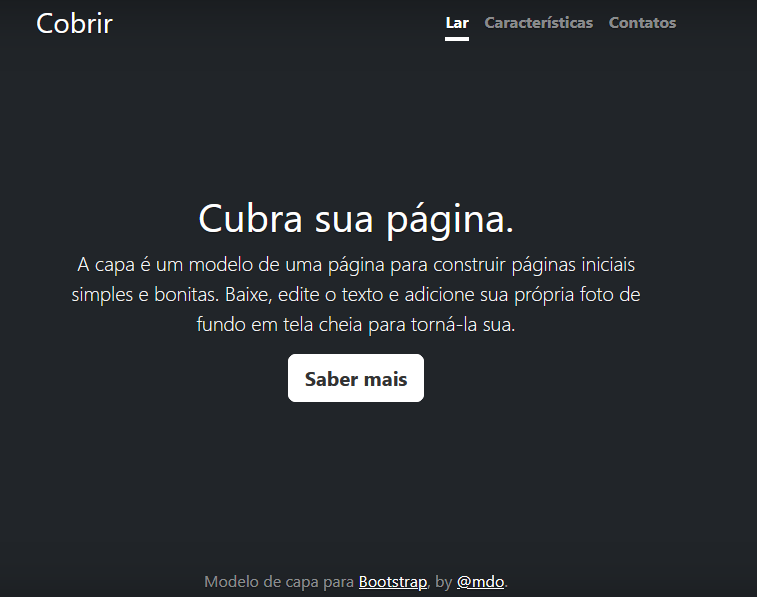

# Índice 

[Descrição](#descri%C3%A7%C3%A3o)  

[Funcionalidades](#funcionalidades)  

[Tecnologia ultilizadas](#tecnologia-ultilizadas)  

[Fontes consultadas](#fontes-consultadas)

[https://github.com/](#httpsgithubcom)

[Autores](#autores)  

 

# 🚀 Projeto - Portifólio para escrita do README

## 📋Descrição
Criação de projeto reponsivo para dispositivos móveis web, com o Bootstrap  que é um framework, utilizado para a criação de interfaces de usuário do tipo Web 2.0, com design responsivo (que se adapta às diferentes tamanhos de tela), padrões de acessibilidade e a modernidade do uso de CSS3, HTML5 e JavaScript.
## 🔧 Funcionalidades
 Funcionalidades 1: Tela inicial, é o primeiro contato que o usuário tem com o site. Portanto, ela é ser objetiva e direta, resumindo os objetivos da ferramenta. Funcionalidades 2: Início, onde o usuário tem acesso a tela inicial e suas informações como novidade, contato e saber mais. Funcionalidades 3: Novidades, que permite o usuário de ficar por dentro de tudo que está acontecendo sobre a página. Funcionalidades 4: Contatos, serve para que o usuário possa tiraram suas dúvidas, além de permitir que deixem seus feedback.
### 🛠️ Tecnologia ultilizadas
 CSS3
 HTML5
 JAVASCRIPT
 ## 📄 Fontes consultadas
https://gist.github.com/lohhans/f8da0b147550df3f96914d3797e9fb89 
https://www.alura.com.br/artigos/escrever-bom-readme
## ✒️ Autores
* Quezia Tamie Kato

